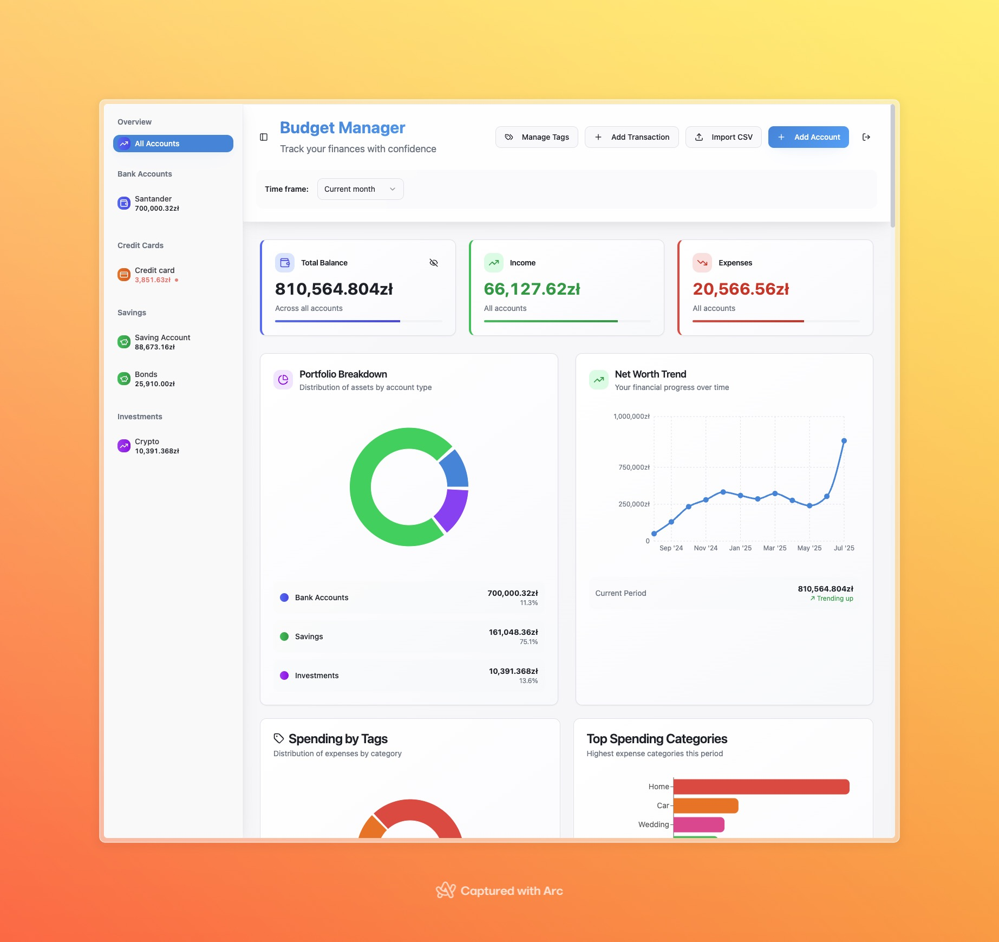

# Budget Manager

A modern personal finance management application with investment tracking capabilities.



## Architecture

- **Frontend**: React + TypeScript + Vite with shadcn/ui components
- **Backend**: Express.js REST API with PostgreSQL
- **Database**: PostgreSQL 15 with Docker
- **Authentication**: Simple password-based access
- **Investment Tracking**: CoinMarketCap API integration for crypto prices

## Features

### 💰 Account Management

- Multiple account types: bank, credit, savings, investment
- Real-time balance calculation
- Account-specific transaction filtering

### 📊 Transaction Tracking

- Income, expense, and transfer transactions
- Pending and cleared status tracking
- Hierarchical tag system with color coding
- Bulk operations (update/delete)
- CSV import for Polish bank formats

### 📈 Investment Portfolio

- Crypto and stock asset tracking
- Real-time price updates via CoinMarketCap API
- Portfolio performance charts
- Manual price entry for custom assets
- Asset search and management

### 🏷️ Tag System

- Hierarchical tag structure
- Color-coded categories
- Parent-child relationships

### 📱 Modern UI

- Responsive design with mobile support
- Interactive charts and visualizations
- Sidebar navigation
- Toast notifications

## Quick Start

### Prerequisites

- Docker and Docker Compose
- Node.js 18+ (for development)

### 1. Clone and Setup

```bash
git clone <repository-url>
cd budget-manager
```

### 2. Configure Environment Variables

Create a `.env` file in the root directory:

```bash
# Application access password
APP_PASSWORD=your_secure_password_here

# CoinMarketCap API key for investment tracking
COINMARKETCAP_API_KEY=your_api_key_here
```

### 3. Start the Application

```bash
docker-compose up -d
```

The application will be available at `http://localhost:8080`

### 4. Access the Application

- **URL**: `http://localhost:8080`
- **Default Password**: Use the password you set in `APP_PASSWORD`

## Environment Variables

### Required Variables

| Variable                | Description                             | Example                 |
| ----------------------- | --------------------------------------- | ----------------------- |
| `APP_PASSWORD`          | Application access password             | `my_secure_password123` |
| `COINMARKETCAP_API_KEY` | CoinMarketCap API key for crypto prices | `your_api_key_here`     |

### Optional Variables

| Variable      | Description         | Default           |
| ------------- | ------------------- | ----------------- |
| `PORT`        | Backend server port | `3001`            |
| `DB_HOST`     | PostgreSQL host     | `localhost`       |
| `DB_PORT`     | PostgreSQL port     | `5432`            |
| `DB_NAME`     | Database name       | `budget_manager`  |
| `DB_USER`     | Database user       | `budget_user`     |
| `DB_PASSWORD` | Database password   | `budget_password` |

## Development Setup

### Manual Development

1. **Start Database Only:**

   ```bash
   docker-compose up postgres -d
   ```

2. **Install Dependencies:**

   ```bash
   # Frontend
   npm install

   # Backend
   cd server && npm install
   ```

3. **Start Services:**

   ```bash
   # Backend (in server directory)
   cd server && npm run dev

   # Frontend (in root directory)
   npm run dev
   ```

### Available Scripts

**Frontend:**

- `npm run dev` - Start development server
- `npm run build` - Build for production
- `npm run preview` - Preview production build
- `npm run lint` - Run ESLint

**Backend:**

- `cd server && npm run dev` - Start with auto-reload
- `cd server && npm start` - Start production server

## API Endpoints

### Authentication

- `POST /api/auth/signin` - Authenticate with password

### Accounts

- `GET /api/accounts` - Get all accounts
- `POST /api/accounts` - Create account
- `DELETE /api/accounts/:id` - Delete account

### Transactions

- `GET /api/transactions` - Get all transactions
- `POST /api/transactions` - Create transaction
- `PUT /api/transactions/:id` - Update transaction
- `DELETE /api/transactions/:id` - Delete transaction
- `POST /api/transactions/bulk-delete` - Bulk delete
- `POST /api/transactions/bulk-import` - Import from CSV

### Tags

- `GET /api/tags` - Get all tags
- `POST /api/tags` - Create tag
- `PUT /api/tags/:id` - Update tag
- `DELETE /api/tags/:id` - Delete tag

### Investments

- `GET /api/investments/:accountId` - Get investment assets
- `POST /api/investments/:accountId/assets` - Add asset
- `PUT /api/investments/assets/:assetId` - Update asset
- `DELETE /api/investments/assets/:assetId` - Delete asset
- `GET /api/investments/search` - Search assets
- `GET /api/investments/price/:assetId` - Get asset price

## Database Schema

### Core Tables

- **accounts**: Bank accounts, credit cards, investments
- **transactions**: Financial transactions with tags
- **tags**: Hierarchical categorization system
- **investments**: Investment account assets and prices

## Contributing

### Development Workflow

1. **Fork the repository**
2. **Create a feature branch:**
   ```bash
   git checkout -b feature/your-feature-name
   ```
3. **Make your changes**
4. **Run linting:**
   ```bash
   npm run lint
   ```
5. **Test your changes**
6. **Submit a pull request**

## Troubleshooting

### Common Issues

**Database Connection:**

```bash
docker-compose logs postgres
```

**API Server:**

```bash
docker-compose logs server
```

**Frontend:**

```bash
docker-compose logs frontend
```

### Reset Database

```bash
docker-compose down -v
docker-compose up -d
```

## License

This work is licensed under the Creative Commons Attribution-NonCommercial 4.0 International License.
To view a copy of this license, visit http://creativecommons.org/licenses/by-nc/4.0/.

You may use, share, and modify this code for personal and educational purposes, but you may not use it commercially.
